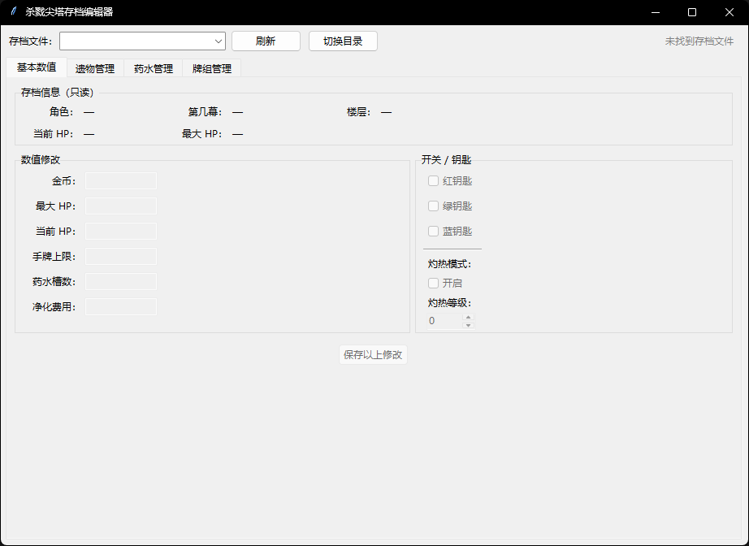
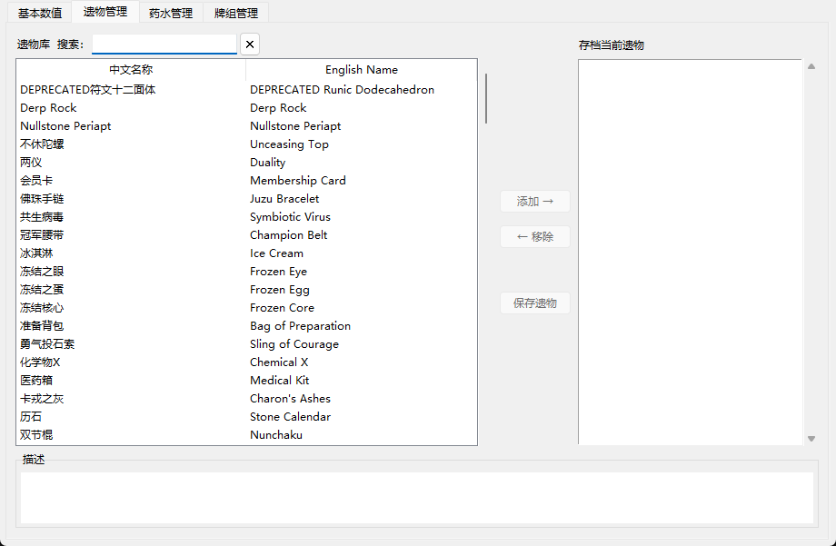
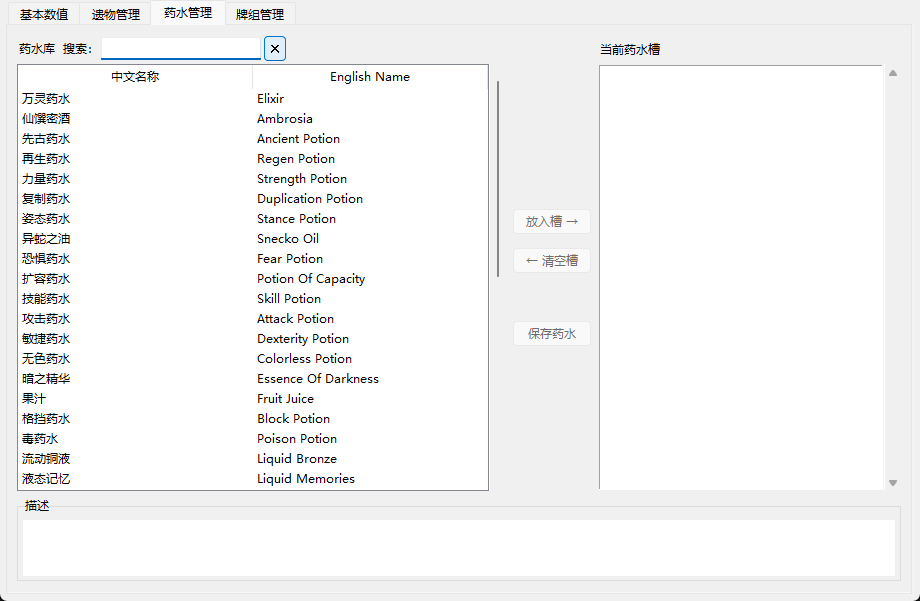
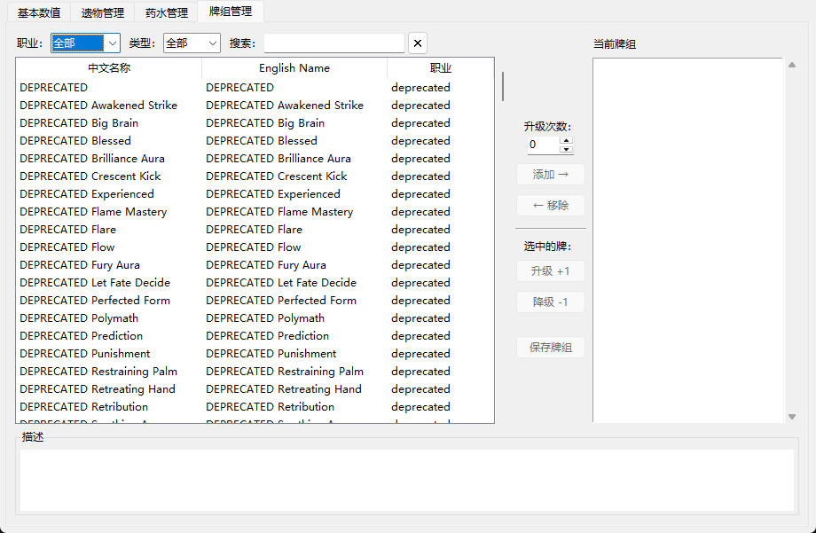

# Slay the Spire Save Editor / 杀戮尖塔存档编辑器

A save file editor for Slay the Spire with full Chinese/English UI support. No Python required — just download and run.

界面支持中英文切换 / UI supports Chinese ↔ English toggle.

## Download / 下载

Go to [Releases](../../releases/latest) and download `STS存档编辑器.exe`. No installation needed — double-click to run.

前往 [Releases](../../releases/latest) 下载 `STS存档编辑器.exe`，无需安装，双击即用。

---

## Features / 功能

| Tab | What you can edit |
|-----|-------------------|
| Stats | Gold, current/max HP, hand size, potion slots, purge cost, all three keys, ascension mode & level |
| Relics | Add / remove relics, searchable with descriptions |
| Potions | Set or clear any potion slot, searchable with descriptions |
| Cards | Add / remove cards, filter by class and type (Attack / Skill / Power), adjust upgrade count |

All relics, potions, and cards show both Chinese and English names. Descriptions switch language with the UI toggle.

---

## Screenshots / 截图

### Stats / 基本数值


### Relics / 遗物管理


### Potions / 药水管理


### Cards / 牌组管理


---

## How to Use / 使用方法

1. **Launch** — on first run the app auto-detects your Steam installation. If not found, a dialog lets you browse to the folder containing `desktop-1.0.jar`.
2. **Select save file** — pick a `.autosave` file from the dropdown at the top.
3. **Edit** — make changes in any tab.
4. **Save** — click the Save button in that tab. The original file is backed up automatically as `*.bak_YYYYMMDD_HHMMSS`.
5. **Language** — click the **EN / ZH** button in the toolbar to toggle the interface language.

> **Important:** Quit the game before editing saves. If the game is running it will overwrite your changes when it saves.

---

1. **启动** — 首次运行自动检测 Steam 安装路径。未检测到时弹出对话框手动选择含 `desktop-1.0.jar` 的游戏目录。
2. **选择存档** — 在顶部下拉框选择 `.autosave` 文件。
3. **修改** — 在各标签页中进行编辑。
4. **保存** — 点击对应标签页的保存按钮。原文件自动备份为 `*.bak_日期时间`。
5. **语言切换** — 点击工具栏 **EN / ZH** 按钮切换界面语言。

> **注意**：请在游戏退出后再编辑存档，否则游戏重新保存时会覆盖修改。

---

## First launch is slow?

The first run parses game data from `desktop-1.0.jar` (~10 seconds). Results are cached; all subsequent launches are near-instant.

首次启动会解析游戏 JAR 包（约 10 秒），之后从缓存加载，几乎瞬间完成。

---

## Technical notes

- Save format: Base64 → XOR decrypt (key `"key"`) → JSON
- Relic / card / potion IDs extracted from Java class bytecode constant pools
- Localisation sourced from `localization/eng/` and `localization/zhs/` inside the game JAR

## Running from source

Python 3.10+, no third-party dependencies.

```bash
python sts_save_editor.py
```

## License

MIT
